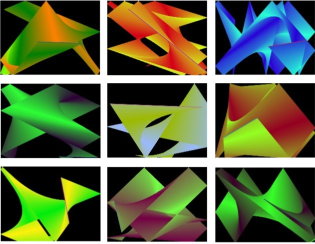



## Magic Wand

### Description

This is Version 2 of the Magic Wand program. It is another Graphical Display program brought to you by RandyGrams. The Wand flies around the screen bouncing off the walls. It is constantly changing colors to create a Gradient effect of swirling and overlapping lines. All of the effects are created using only straight lines.

I have done a lot of clean-up and simplification since Version 1 but the biggest change is the ability to display the DeskTop WallPaper (see below for more details).

Click the Left Mouse Button to start a new Drawing. Click the Right Mouse Button to open the Menu.

The "Controls" section of the Menu has the "Check Box" called Show DeskTop WallPaper. When it is checked (Default), your DeskTop WallPaper will be displayed (Full Screen). Click it if you prefer to make the Back Ground Black.

The next option is Speed. Click it to open the Speed control. You can make the Wand move Faster or Slower.

The last option is Trail. If you turn the Trail off, the Wand still flies around the screen and bounces off the walls, but it doesn't leave a Gradient Trail behind.

That's it. Have fun and enjoy using the Magic Wand.
 
### More Info
 
Great looking Gradient graphics... now includes Desktop WallPeeper.

             |
---                |---
**Submitted On**   |2006-06-14 00:55:58
**By**             |[Randy Giese](https://github.com/Planet-Source-Code/PSCIndex/blob/master/ByAuthor/randy-giese.md)
**Level**          |Intermediate
**User Rating**    |5.0 (25 globes from 5 users)
**Compatibility**  |VB 6\.0
**Category**       |[Graphics](https://github.com/Planet-Source-Code/PSCIndex/blob/master/ByCategory/graphics__1-46.md)
**World**          |[Visual Basic](https://github.com/Planet-Source-Code/PSCIndex/blob/master/ByWorld/visual-basic.md)
**Archive File**   |[Magic\_Wand2000746142006\.zip](https://github.com/Planet-Source-Code/randy-giese-magic-wand__1-60866/archive/master.zip)

